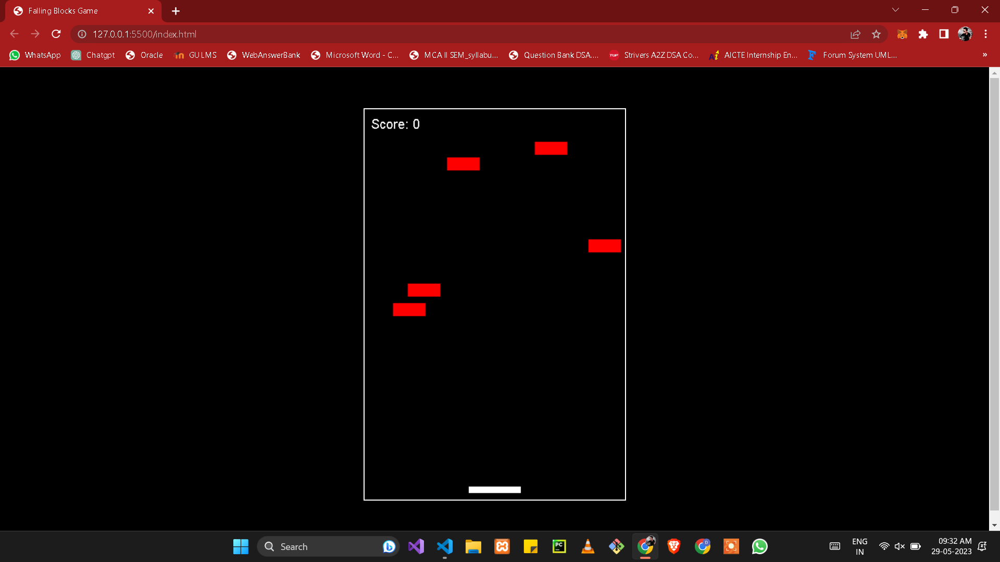

# Falling Blocks Game

A simple falling blocks game implemented using HTML, CSS, and JavaScript.



## Getting Started

These instructions will help you get a copy of the falling blocks game up and running on your local machine for development and testing purposes.

### Prerequisites

To run the game, you need a web browser that supports HTML5, CSS3, and JavaScript.

### Installation

1. Clone the repository:

   ```shell
   git clone https://github.com/your-username/falling-blocks-game.git
   ```

2. Navigate to the project directory:

   ```shell
   cd falling-blocks-game
   ```

3. Open the `index.html` file in your preferred web browser.

## How to Play

The objective of the game is to control a falling block and prevent it from reaching the bottom of the game container. The block falls continuously from the top of the container, and your task is to move the block left or right to avoid obstacles and keep it from touching the bottom.

## Controls

Arrow Left: Move the player platform to the left.

Arrow Right: Move the player platform to the right.

Spacebar: Pause the game.

R: Resume the game.

Enter: Restart the game.

## High score
The high score is stored in local storage. The player with the highest score at the end of the game wins!

## Built With

- HTML
- CSS
- JavaScript

